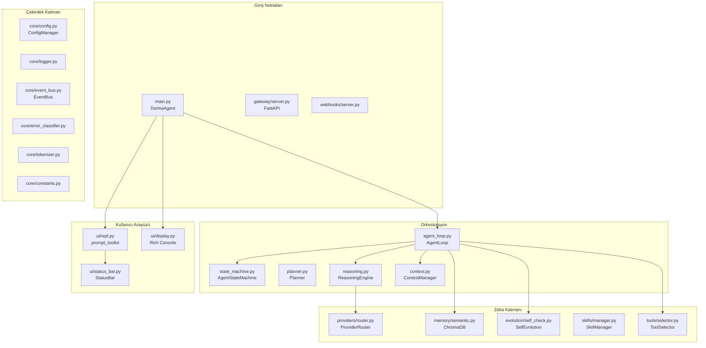

# Dorina Agent

**Self-hosted CLI AI agent** — state machine, streaming, self-testing, multi-provider, 65 tools, 15 categories.


> Built from 16 open-source reference projects (Hermes, Odysseus, Claude Code, Superpowers, and more).

## Features

- **State Machine** — deterministic agent loop with 9 states
- **Streaming** — token-by-token real-time output
- **Multi-Provider** — DeepSeek, Groq, OpenRouter, SiliconFlow, Ollama
- **Self-Testing** — auto-test after every write_file/patch change
- **Self-Evolution** — learns from mistakes, creates skills
- **Live Status Bar** — prompt_toolkit toolbar, never overwrites input
- **RAG Tool Selector** — picks relevant tools per turn via ChromaDB
- **Auto-Dependency Resolution** — tool fails → research → install → retry
- **Sub-Agent System** — parallel task delegation with isolated executors
- **Cost-Aware Routing** — simple tasks use fast model, complex tasks use deep model
- **Session Management** — save, load, export (JSON/MD)
- **65 Tools, 15 Categories** — file(7), git(7), data(17), system(11), web(3), network(3), audio(4), terminal, vision, delegation, mcp, research, browser, communication, development

## Quick Start

```bash
# 1. Clone
git clone https://github.com/atalhatulu/dorina-agent.git
cd dorina-agent

# 2. Install
python -m venv .venv
source .venv/bin/activate
pip install -r requirements.txt

# 3. Configure
cp .env.example .env
# Edit .env: add your API keys (DEEPSEEK_API_KEY, GROQ_API_KEY, etc.)

# 4. Run
python main.py
```

Or simply: `./start-dorina.sh`

## Prerequisites

| Feature | Required |
|---------|----------|
| **Core** | Python ≥3.10 |
| **Best model** | DeepSeek API key (`DEEPSEEK_API_KEY=...`) |
| **Browser** | Playwright (`playwright install chromium`) |
| **Vision** | Pillow |
| **Audio** | edge-tts |
| **Sandbox** | Docker (optional) |

## Commands

| Command | Description |
|---------|-------------|
| `/help` | Show help |
| `/tools` | List all tools |
| `/status` | Session status |
| `/save <title>` | Save session |
| `/load <id>` | Load session |
| `/sessions` | List sessions |
| `/export <json/md>` | Export session |
| `/new` | New session |
| `/clear` | Clear screen |
| `/exit` | Exit |

## Architecture



## Project Structure

```
dorina-agent/
├── core/             # Config, logger, event bus, constants
├── orchestrator/     # State machine, agent loop, reasoning, context
├── providers/        # Multi-model router with fallback
├── tools/            # Tool registry, executor, 56+ built-in tools
├── ui/               # Terminal UI (prompt_toolkit + Rich)
├── knowledge/        # Web search, deep research
├── memory/           # Semantic memory (ChromaDB)
├── evolution/        # Self-evolution, multi-review
├── skills/           # Skill system
├── session/          # Session manager & export
├── security/         # Approval, auth, sandbox
├── gateway/          # FastAPI REST API
├── agents/           # Multi-agent system
├── tests/            # 240 tests (61% coverage)
└── soul/             # Personality system
```

## Tests

```bash
pytest tests/ -q --tb=short
# 240 passed, 0 failed
```

Coverage: **61%** (core, orchestrator, tools, knowledge, session, evolution).

## Credits

Built with inspiration from:
- **Hermes Agent** — tool architecture, session management, state machine
- **Claude Code** — file history, task system, cost tracker
- **Odysseus** — deep research, filesystem tools
- **Superpowers** — skills/workflows
- **smolagents** — agent patterns
- **CrewAI** — multi-agent architecture

## License

MIT
