# Dorina Agent Architecture

> **Version:** 2.0.0  
> **Modules:** 38+ | **Tools:** 66+ | **Tests:** 88+  
> **License:** MIT

---

## Table of Contents

- [Overview](#overview)
- [Project Structure](#project-structure)
- [Agent Loop & State Machine](#agent-loop--state-machine)
- [Event Bus System](#event-bus-system)
- [Tool Registry & Executor](#tool-registry--executor)
- [Multi-Model Provider System](#multi-model-provider-system)
- [Session Management](#session-management)
- [Memory System](#memory-system)
- [Self-Evolution Module](#self-evolution-module)
- [File History System](#file-history-system)
- [Security Layer](#security-layer)
- [UI Layer](#ui-layer)
- [Data Flow Diagrams](#data-flow-diagrams)

---

## Overview

Dorina Agent is a **self-hosted CLI AI agent** that runs in your terminal. It
uses a persistent think-execute loop: for every user request, it plans steps,
calls tools via a registered tool system, evaluates results, and iterates until
the task is complete. All orchestration happens locally — no cloud dependency
beyond the LLM API calls.

### High-Level Architecture

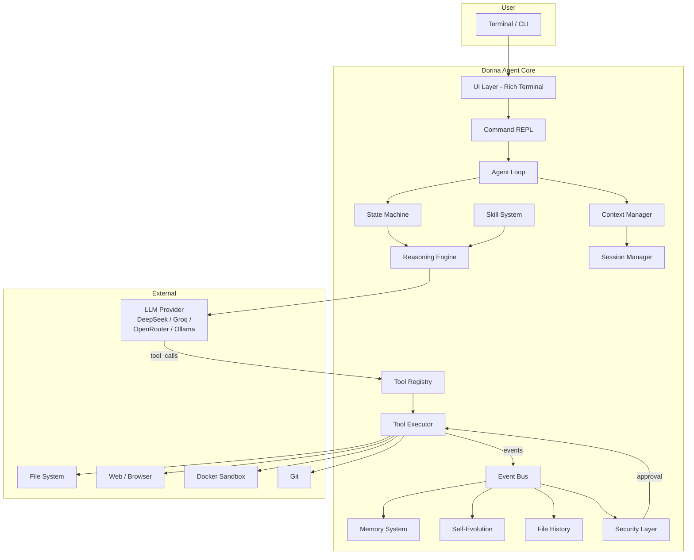

---

## Project Structure

```
dorina-agent/                          # Project root
├── core/                              # Foundation layer
│   ├── config.py                      # YAML config loader
│   ├── event_bus.py                   # Pub/sub event system
│   ├── constants.py                    # Global constants
│   └── logger.py                      # Structured logging
│
├── orchestrator/                      # Agent brain
│   ├── agent_loop.py                  # Main think-execute loop
│   ├── state_machine.py               # State machine (LangGraph-inspired)
│   ├── reasoning.py                   # LLM communication via litellm
│   ├── context.py                     # Conversation context manager
│   ├── compressor.py                  # Context compression at 75% fill
│   ├── planner.py                     # Task planning & decomposition
│   └── plan_tools.py                  # Tool-based planning
│
├── tools/                             # Tool system
│   ├── registry.py                    # Tool registration & lookup
│   ├── executor.py                    # Tool execution engine
│   ├── builtin/
│   │   ├── basic.py                   # Core tools (read/write/search files)
│   │   ├── advanced.py                # Utility tools (calc, hash, uuid...)
│   │   ├── modules.py                 # Web & knowledge tools
│   │   ├── terminal_pro.py            # 19 terminal/system tools
│   │   └── terminal_utils.py          # 15 terminal utility tools
│   ├── mcp/client.py                  # MCP (Model Context Protocol)
│   ├── delegate.py                    # Task delegation tools
│   ├── tool_test.py                   # Tool testing framework
│   └── tool_verify.py                 # Tool verification & caching
│
├── providers/                         # LLM provider system
│   ├── router.py                      # Provider router with fallback chain
│   └── keys.py                        # Encrypted API key storage
│
├── agents/                            # Multi-agent system
│   ├── task_tools.py                  # Task creation & management
│   └── ...                            # Agent definitions
│
├── session/                           # Session management
│   ├── manager.py                     # SQLAlchemy-based CRUD
│   └── export.py                      # Export to JSON/MD/HTML
│
├── memory/                            # Memory system
│   ├── semantic.py                    # ChromaDB vector memory
│   ├── episodic.py                    # Episode recording
│   ├── procedural.py                  # Procedural skill memory
│   └── auto_extract.py                # Auto-extraction from conversations
│
├── history/                           # File history
│   └── file_history.py                # Snapshot/restore/diff engine
│
├── evolution/                         # Self-evolution
│   ├── self_check.py                  # Pattern learning, code audit, auto-fix
│   └── tools.py                       # self_check, self_learn tools
│
├── knowledge/                         # Knowledge & search
│   ├── rag_engine.py                  # RAG with ChromaDB
│   ├── web_scrape.py                  # Web scraping
│   └── deep_research.py               # Multi-step research
│
├── security/                          # Security layer
│   ├── approval.py                    # Smart approval mode
│   ├── sandbox.py                     # Docker sandbox integration
│   └── auth.py                        # Auth & redaction
│
├── skills/                            # Skill system
│   ├── manager.py                     # Skill lifecycle
│   └── store/                         # Skill definitions
│
├── soul/                              # Personality system
│   ├── personality.py                 # System prompt builder
│   └── soul.md                        # Personality definition file
│
├── ui/                                # Terminal UI
│   ├── repl.py                        # Prompt-toolkit REPL
│   ├── display.py                     # Rich terminal output
│   ├── status_bar.py                  # Live status bar
│   ├── banner.py                      # Startup banner
│   ├── setup_wizard.py                # First-run /setup wizard
│   └── provider_selector.py           # Provider selection menu
│
├── gateway/                           # REST API
│   └── ...                            # FastAPI endpoints
│
├── export/                            # Export formats
│   ├── formats.py                     # JSON, Markdown, HTML export
│   └── ...                            
│
├── monitoring/                        # Observability
│   └── metrics.py                     # Token & cost tracking
│
├── browser/                           # Playwright browser
│   └── client.py                      # Browser automation
│
├── tests/                             # Test suite (88+ tests)
│
├── config.yaml                        # Agent configuration
├── main.py                            # Entry point
├── start-dorina.sh                    # One-click launcher
├── soul.md                            # Personality definition
└── .env.local                         # API keys (gitignored)
```

---

## Agent Loop & State Machine

### Agent Loop

The `AgentLoop` in `orchestrator/agent_loop.py` is the core execution engine.
For every user input, it runs a **persistent task loop**:

```mermaid
sequenceDiagram
    participant User
    participant Loop as AgentLoop
    participant SM as StateMachine
    participant LLM as ReasoningEngine
    participant Reg as ToolRegistry
    participant Exec as ToolExecutor

    User->>Loop: user input
    Loop->>Loop: add to context
    Loop->>Loop: check context compression
    Loop->>SM: start IDLE→THINKING
    SM->>LLM: think(system_prompt, messages, schemas)
    LLM-->>SM: response (content + tool_calls)

    alt has tool_calls
        SM->>Loop: TOOL_CALLING state
        loop each tool call
            Loop->>Reg: get tool definition
            Reg-->>Loop: ToolDef
            Loop->>Exec: execute(name, args)
            Exec-->>Loop: result string
            Loop->>Loop: add result to context
        end
        SM->>SM: WAITING_RESULT → THINKING
        Note over SM,LLM: Up to 8 iterations
    else no tool_calls
        SM->>Loop: DIRECT_REPLY → DONE
        Loop-->>User: final response
    end
```

Key features:

- **Plan-first**: On the first iteration, the LLM is prompted to create a
  step-by-step plan before executing
- **Max iterations**: 8 tool-calling iterations per user input
- **Max turns**: 50 consecutive user/assistant exchanges
- **Context compression**: At 75% of 128K token context, older messages are
  automatically summarized
- **Status tracking**: Every turn updates the status bar (tokens used, tools called, cost)

### State Machine

The `StateMachine` (inspired by LangGraph's StateGraph) manages agent states:

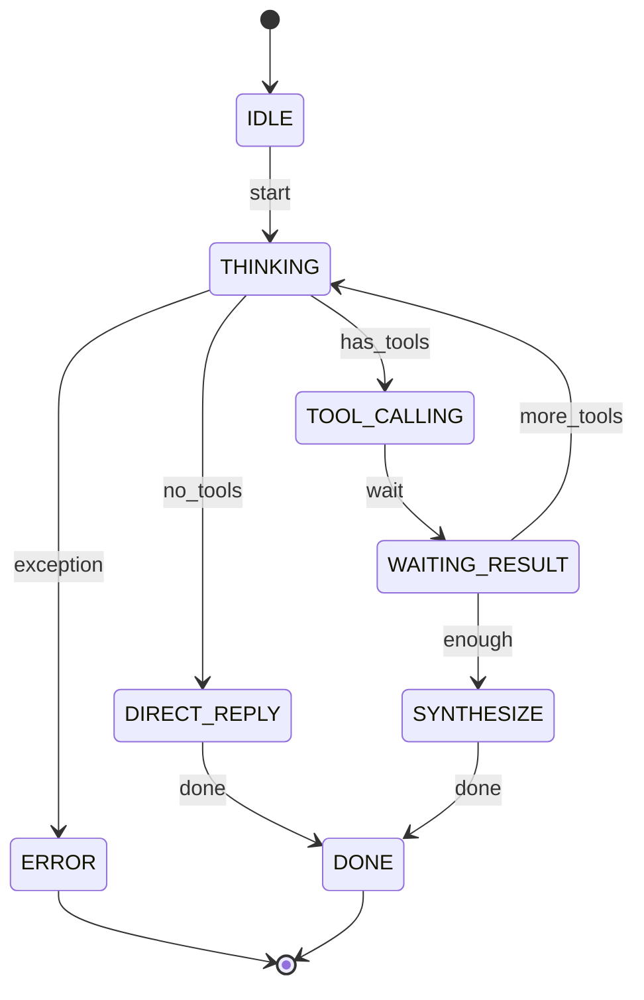

States:
| State | Description |
|-------|-------------|
| `IDLE` | Waiting for user input |
| `THINKING` | LLM is reasoning about next action |
| `TOOL_CALLING` | Tool execution in progress |
| `WAITING_RESULT` | Awaiting tool results |
| `SYNTHESIZE` | Combining multiple tool results |
| `DIRECT_REPLY` | Answering without tools |
| `DONE` | Turn complete |
| `ERROR` | Unrecoverable error |

---

## Event Bus System

The event bus (`core/event_bus.py`) is a **publish/subscribe** system that
decouples modules. Instead of direct method calls, modules fire events and
subscribers react.

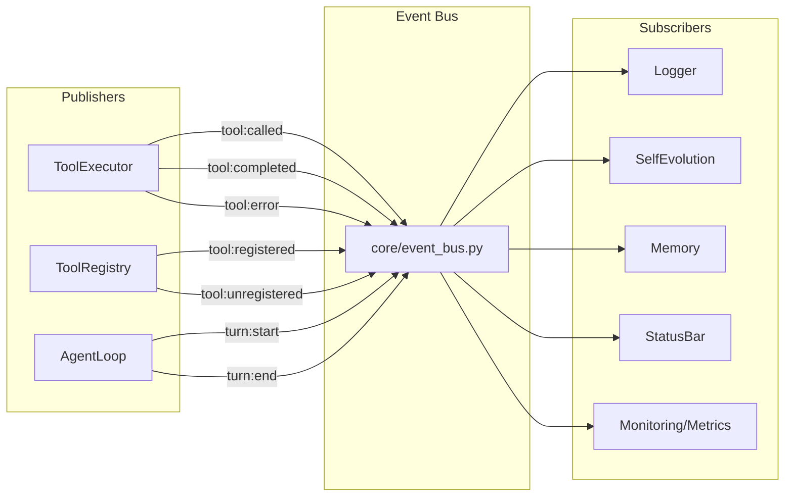

### Event Catalog

| Event | Publisher | Payload | Subscribers |
|-------|-----------|---------|-------------|
| `tool:called` | `ToolExecutor` | `name`, `arguments` | Logger, SelfEvolution, StatusBar |
| `tool:completed` | `ToolExecutor` | `name`, `result` | Logger, Metrics |
| `tool:error` | `ToolExecutor` | `name`, `error` | Logger |
| `tool:registered` | `ToolRegistry` | `name`, `toolset` | Logger |
| `tool:unregistered` | `ToolRegistry` | `name` | Logger |
| `turn:start` | `AgentLoop` | `turn_number` | Metrics |
| `turn:end` | `AgentLoop` | `response` | Metrics |

### Usage Example

```python
from core.event_bus import bus

# Subscribe
bus.subscribe("tool:called", my_handler)

# Publish
bus.publish("tool:called", name="read_file", arguments={"path": "/tmp/test"})
```

Benefits:
- **Decoupling**: Modules don't import each other
- **Extensibility**: New features hook in via subscription
- **Observability**: Central logging, metrics, and monitoring

---

## Tool Registry & Executor

### Tool Registry

The `ToolRegistry` (`tools/registry.py`) is a central registry for all tools.
Tools are defined as `ToolDef` dataclass instances:

```python
@dataclass
class ToolDef:
    name: str
    description: str
    parameters: dict       # JSON schema
    handler: Callable
    toolset: str           # Category ("terminal", "web", "utility", ...)
    requires_env: list[str]
    check_fn: Callable | None  # Availability check
    is_async: bool
```

### Registration Flow

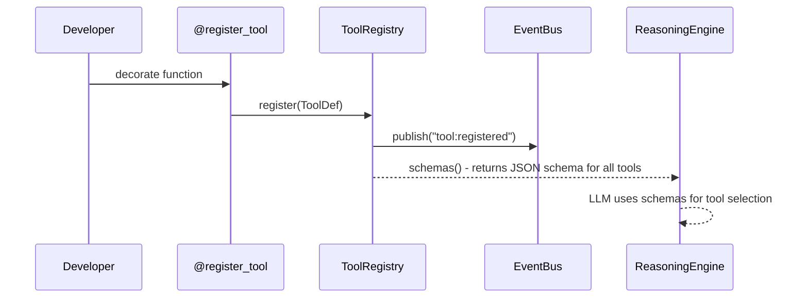

### Tool Categories

| Toolset | Count | Examples |
|---------|-------|----------|
| `terminal` | ~34 | read_file, write_file, search_files, patch, head, tail, tree |
| `utility` | ~9 | calc, convert, hash, json_pretty, base64, uuid |
| `web` | ~5 | web_search, web_fetch, browser_navigate |
| `git` | ~2 | git_status, git_log |
| `system` | ~5 | ps, kill, system_info, disk_usage, ping |
| `history` | ~3 | history, restore, diff_history |
| `evolution` | ~2 | self_check, self_learn |
| `agent` | ~3 | task_create, task_list, task_status |
| `testing` | ~2 | tool_test, tool_test_all |
| `planner` | ~1 | run_workflow |
| **Total** | **66+** | |

### Tool Executor

The `ToolExecutor` (`tools/executor.py`) handles:

1. **Parameter resolution**: JSON string → dict
2. **Call counting**: Enforces `MAX_TOOL_CALLS_PER_TURN`
3. **Async support**: Automatically detects and runs async handlers
4. **Error handling**: Returns `{"error": ...}` JSON on failure
5. **Event publishing**: Fires `tool:called`, `tool:completed`, `tool:error`

---

## Multi-Model Provider System

Dorina supports multiple LLM providers with automatic fallback.

```mermaid
graph TD
    subgraph ReasoningEngine
        THINK[think()]
        FALLBACK[_try_fallback()]
    end

    subgraph ProviderRouter
        P1[deepseek<br/>weight: 1]
        P2[groq<br/>weight: 2]
        P3[openrouter<br/>weight: 2]
        P4[ollama<br/>weight: 3]
    end

    THINK -->|try| P1
    P1 -->|success| R1[Response]
    P1 -->|error| FALLBACK
    FALLBACK -->|try| P2
    P2 -->|success| R2[Response]
    P2 -->|error| FALLBACK
    FALLBACK -->|try| P3
    FALLBACK -->|try| P4
    P3 -->|success| R3[Response]
    P4 -->|success| R4[Response]
    P4 -->|error| EX[All providers failed]
```

### Provider Configuration

```yaml
model:
  default: deepseek/deepseek-v4-flash
  provider: deepseek
  fallback_providers:
    - openrouter/openai/gpt-4o-mini
    - ollama/llama3
```

### Supported Providers

| Provider | Type | API Key Required | Models |
|----------|------|-----------------|--------|
| DeepSeek | Remote | Yes | deepseek-chat, deepseek-v4-flash, deepseek-v4-pro |
| Groq | Remote | Yes (free) | llama-3.3-70b-versatile, llama-3.1-8b-instant |
| OpenRouter | Remote | Yes | 200+ models (pay-per-use) |
| Ollama | Local | No | Any local model |
| OpenAI | Remote | Yes | gpt-4o-mini, gpt-4o |
| Anthropic | Remote | Yes | claude-sonnet-4, claude-haiku-4 |
| Google | Remote | Yes | gemini-2.5-pro, gemini-2.5-flash |
| SiliconFlow | Remote | Yes | DeepSeek-V3, DeepSeek-R1 (free) |

### Fallback Chain

1. Primary provider (DeepSeek by default)
2. If error → try `fallback_providers` in order
3. If all fail → raise `Exception("Tum provider'lar basarisiz oldu")`

### API Key Management

Keys are stored via `providers/keys.py` with encrypted storage and loaded into
environment variables at startup. The `.env.local` file stores the raw keys:

```
DEEPSEEK_API_KEY=sk-...
GROQ_API_KEY=gsk_...
OPENROUTER_API_KEY=sk-or-...
```

---

## Session Management

Sessions are managed by `SessionManager` (`session/manager.py`) using
**SQLAlchemy + SQLite**.

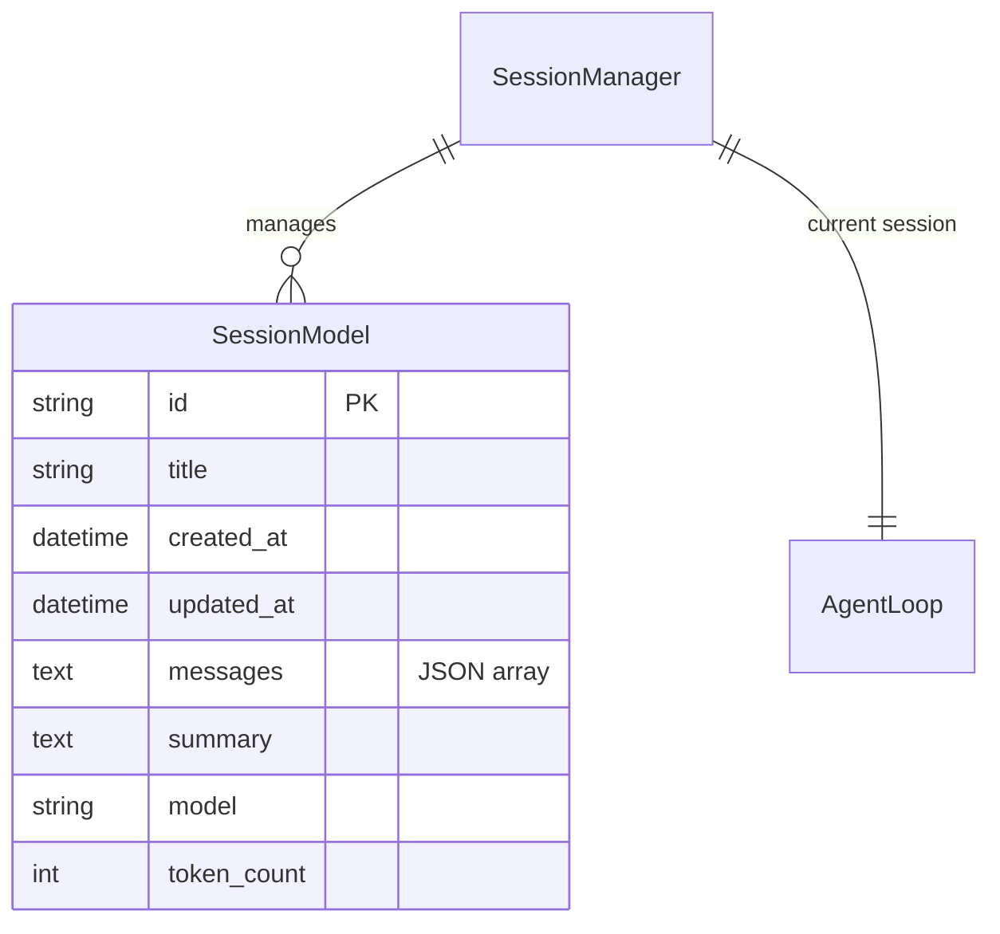

### Session Lifecycle

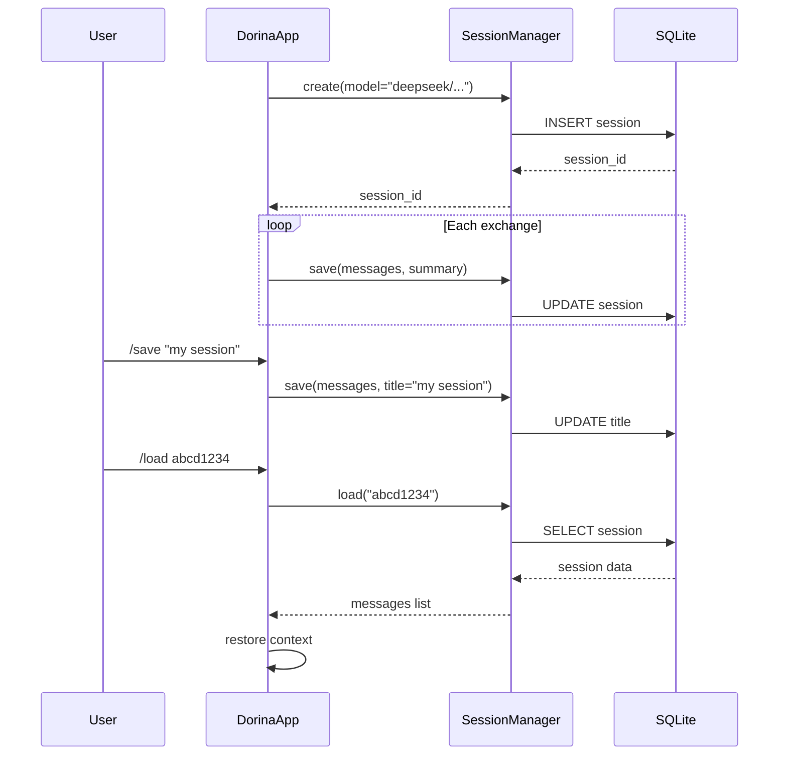

### Commands

| Command | Description |
|---------|-------------|
| `/save <title>` | Save current session |
| `/load <id>` | Load a saved session |
| `/sessions` | List all sessions (last 20) |
| `/ara <query>` | Search sessions by title/content |
| `/export json\|md\|html` | Export to file |

### Session Export

Sessions can be exported in three formats:
- **JSON**: Full structured data with metadata
- **Markdown**: Human-readable conversation log
- **HTML**: Styled web page with syntax highlighting

---

## Memory System

Dorina has a four-tier memory architecture:

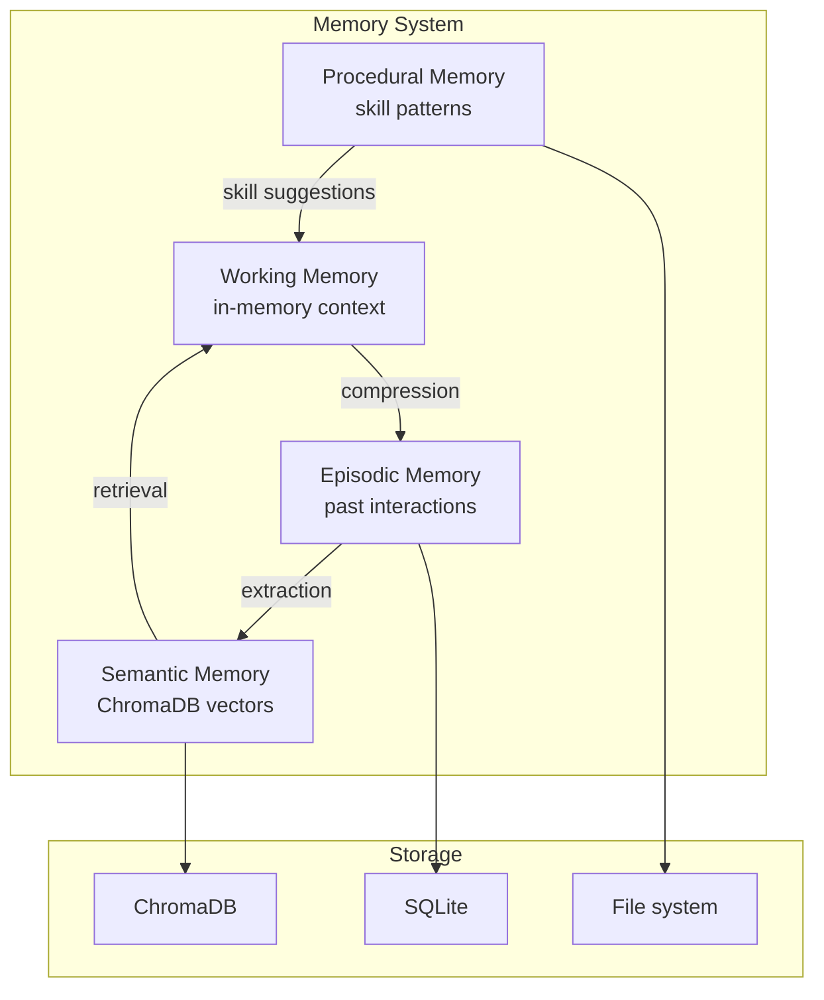

| Memory Type | Storage | Purpose |
|-------------|---------|---------|
| **Working** | In-memory (Python list) | Current conversation context |
| **Episodic** | SQLite | Past conversation episodes |
| **Semantic** | ChromaDB + BAAI/bge-small-en-v1.5 | Long-term knowledge (vector search) |
| **Procedural** | Filesystem | Learned skill patterns |

### Auto-Extraction

The `AutoExtractor` monitors conversations and automatically extracts:
- User preferences and facts → Semantic Memory
- Recurring patterns → Procedural Memory
- Important episodes → Episodic Memory

### RAG Engine

The `RAGEngine` (`knowledge/rag_engine.py`) provides retrieval-augmented
generation using ChromaDB:
- Documents are vectorized and stored
- On user query, relevant documents are retrieved as context
- Works alongside semantic memory for comprehensive knowledge access
- **Research integration**: Research findings and full reports can be added to the vector store via `add_research_finding()` and `add_research_report()`
- **Source filtering**: Query results can be filtered by source type (e.g., `filter_source="deep_research"`)

---

## Deep Research Pipeline

The Deep Research system (`knowledge/deep_research.py`) is a **multi-step research pipeline** that uses LLM-driven orchestration for comprehensive web research.

### Pipeline Stages

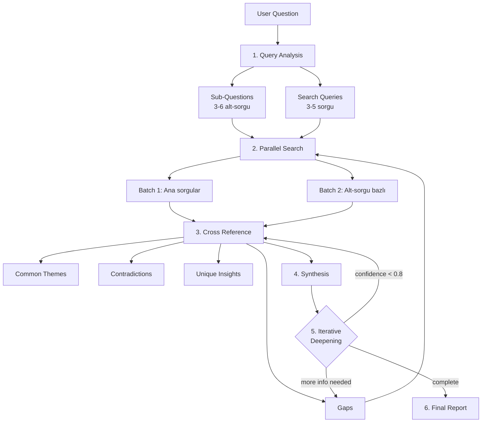

### Key Components

| Component | Description |
|-----------|-------------|
| **Query Analysis** | LLM analyzes the question, generates sub-questions, key topics, and search queries |
| **Parallel Search** | Executes multiple search queries in parallel across DuckDuckGo |
| **Cross Reference** | LLM identifies common themes, contradictions, unique insights, and gaps |
| **Synthesis** | Combines all findings into a coherent answer |
| **Iterative Deepening** | Fills gaps by re-searching and re-synthesizing until confidence ≥ 0.8 |
| **Final Report** | Comprehensive report with executive summary, evidence, and confidence assessment |

### Integration Points

- **`knowledge/web_search.py`**: Provides the `search_web()`, `search_news()`, and `search_multi()` methods used by the research pipeline
- **`knowledge/rag_engine.py`**: Research findings and reports can be stored in the vector database via `add_research_finding()` and `add_research_report()`
- **`knowledge/web_scrape.py`**: Fetches full page content for deeper analysis

### Stats Tracking

```python
researcher = DeepResearcher()
report = researcher.research("What is the latest in AI?")
stats = researcher.get_stats()
# {
#   "queries": 12,
#   "pages_fetched": 8,
#   "sub_questions": 4,
#   "parallel_batches": 3,
#   "errors": 0,
#   "findings": 24,
#   "iterations": 2,
#   "elapsed": 45.2
# }
```

---

## Workflow Engine

The Workflow Engine (`workflows/`) provides **DAG-based workflow execution** inspired by LangGraph's StateGraph and CrewAI Flow patterns.

### Architecture

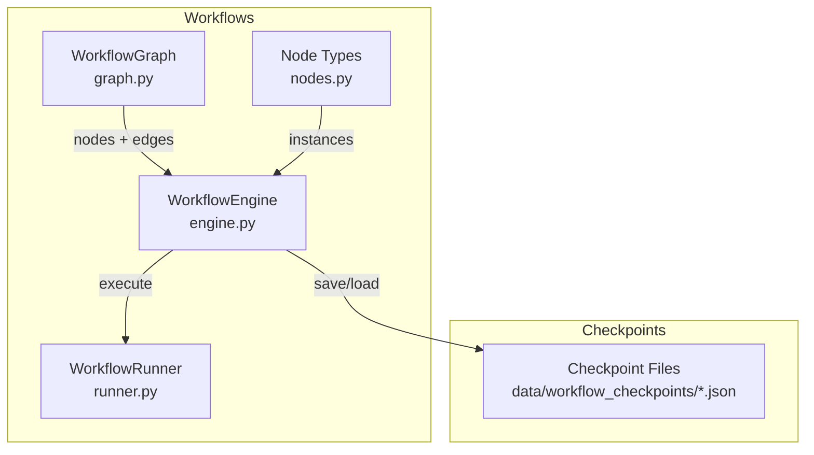

### Node Types

| Node | Class | Description |
|------|-------|-------------|
| **Input** | `InputNode` | Entry point — passes input data into the workflow |
| **Output** | `OutputNode` | Exit point — collects and formats final output |
| **LLM** | `LLMNode` | Sends a prompt to the language model |
| **Tool** | `ToolNode` | Executes a registered tool (web_search, read_file, etc.) |
| **Code** | `CodeNode` | Runs inline Python code with sandboxed execution |
| **Condition** | `ConditionNode` | Evaluates an expression and routes execution |
| **Loop** | `LoopNode` | Repeats a subgraph of nodes until condition met |
| **Terminal** | `TerminalNode` | Executes a shell command |
| **Sleep** | `SleepNode` | Pauses execution for a given duration |

### Graph Definition

```python
from workflows.graph import WorkflowGraph

graph = WorkflowGraph()
graph.add_node("input", "Input", {"description": "User query"})
graph.add_node("llm1", "LLM", {
    "prompt": "Analyze this: {input}",
    "system_prompt": "You are a research assistant.",
    "temperature": 0.7,
})
graph.add_node("tool1", "Tool", {
    "tool": "web_search",
    "params": {"query": "{input}"}
})
graph.add_node("condition1", "Condition", {
    "condition": "len(input) > 100"
})
graph.add_node("llm2", "LLM", {
    "prompt": "Summarize: {input}"
})
graph.add_node("output", "Output", {})

# Define edges
graph.add_edge("input", "llm1")
graph.add_edge("llm1", "tool1")
graph.add_edge("tool1", "condition1")
graph.add_edge("condition1", "llm2", condition="true")   # If long text
graph.add_edge("condition1", "output", condition="false")  # If short text
graph.add_edge("llm2", "output")
```

### Checkpoint System

The engine supports **save/restore checkpoints** for workflow execution:

```python
from workflows.engine import WorkflowEngine

engine = WorkflowEngine()

# Execute and auto-save checkpoints
state = await engine.run(graph, input_data="Hello")

# List checkpoints
checkpoints = engine.get_checkpoints()

# Resume from checkpoint
state = await engine.resume("execution-id-here")
```

### Integration

- **`workflows/runner.py`**: Provides backward-compatible `WorkflowRunner` with both simple step-based and DAG-based execution
- **`tools/builtin/modules.py`**: The `run_workflow` tool uses `WorkflowRunner.execute()` for step-based workflows
- The engine auto-creates checkpoints in `data/workflow_checkpoints/` after each node completion

---

## Self-Evolution Module

The self-evolution system (`evolution/self_check.py`) makes Dorina
self-improving. It monitors usage, learns patterns, audits code, and
auto-generates skills.

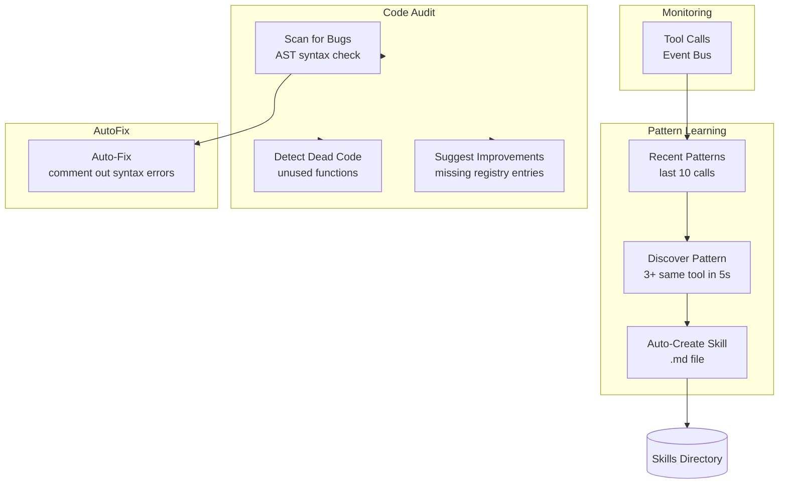

### Components

| Component | Description | Trigger |
|-----------|-------------|---------|
| **Pattern Learning** | Tracks tool call frequency, discovers patterns (3+ same tool in 5 seconds) | Event-driven (`tool:called`) |
| **Auto-Skill Creation** | Creates `.md` skill files for frequently repeated tool patterns | On 2+ pattern detections |
| **Code Audit** | Scans all `.py` files for syntax errors, dead code, and missing registry entries | On `/self_check` |
| **Auto-Fix** | Attempts to fix syntax errors by commenting out problematic lines | During self_check |
| **Improvement Suggestions** | Finds tools registered but not in the registry, suggests fixes | During self_check |

### Tools

| Tool | Description |
|------|-------------|
| `self_check` | Full code audit: bug scan, dead code detection, improvement suggestions |
| `self_learn` | View learned patterns and auto-created skills |

---

## File History System

The file history system (`history/file_history.py`) is inspired by Claude
Code's snapshot system. It automatically snapshots files before modification
and provides rollback capabilities.

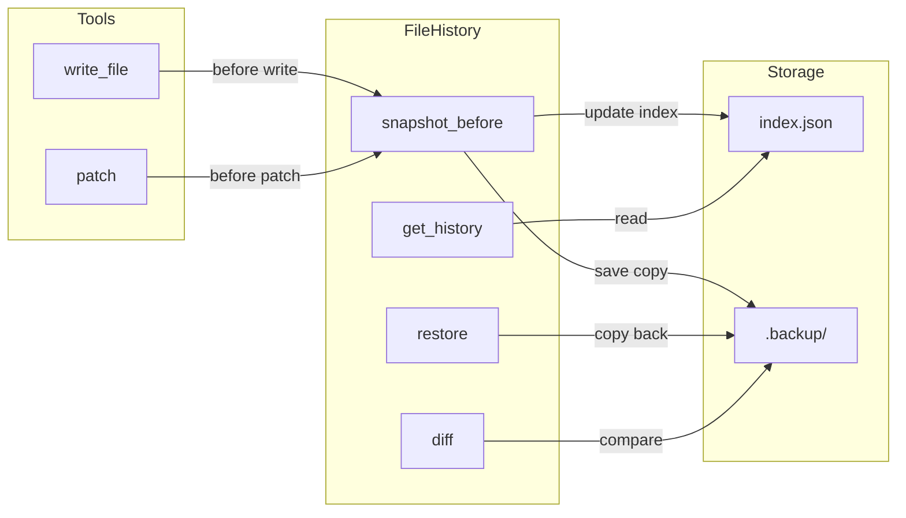

### Key Features

- **Automatic snapshots**: Taken before every `write_file` or `patch` call
- **Max snapshots**: 100 (oldest are automatically pruned)
- **Deduplication**: MD5 hash prevents duplicate backups
- **History tracking**: Per-file and global snapshot history
- **Restore**: Roll back to any previous snapshot
- **Diff**: Unified diff between current file and any snapshot

### Tools

| Tool | Description |
|------|-------------|
| `history` | Show file snapshot history (optional file filter) |
| `restore` | Restore a file to a previous snapshot |
| `diff_history` | Show unified diff between current and snapshot |

> The history tools are registered in `history/tools.py` and use the global
> `file_history` singleton defined in `history/file_history.py`.

---

## Security Layer

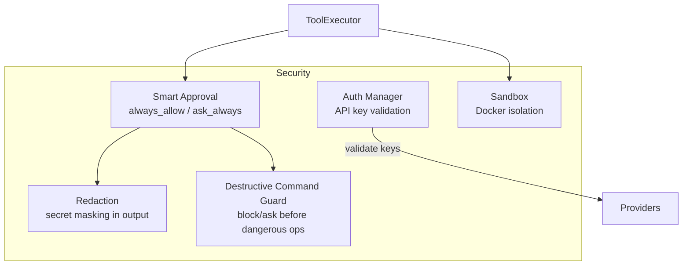

| Security Feature | Description |
|-----------------|-------------|
| **Always-allow tools** | Safe tools run without confirmation (read_file, search_files, etc.) |
| **Ask-always tools** | Dangerous tools require user confirmation (delete_file, rm, etc.) |
| **Secret redaction** | API keys and secrets are masked in tool output |
| **Docker sandbox** | Optional sandbox for code execution isolation |
| **Destructive command guard** | Blocks or warns on destructive operations |

### Config Example

```yaml
security:
  always_allow:
    - read_file
    - search_files
    - web_search
  ask_always:
    - delete_file
    - rm
    - execute_code
  redact_secrets: true
  block_destructive_commands: true
```

---

## UI Layer

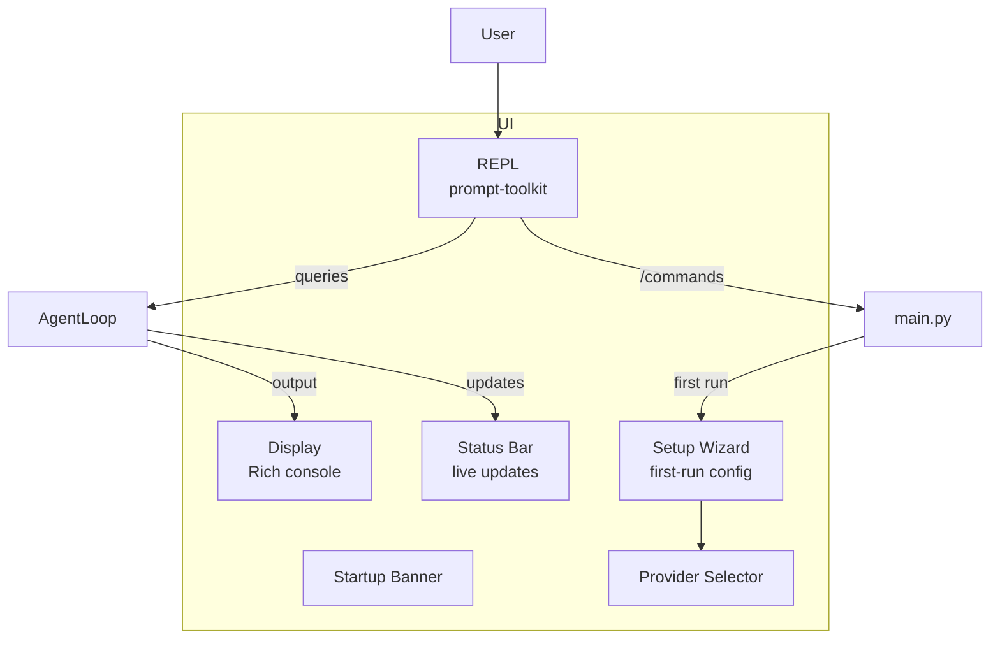

| Component | Library | Purpose |
|-----------|---------|---------|
| **REPL** | `prompt-toolkit` | Interactive input with history, completion, syntax highlighting |
| **Display** | `rich` | Markdown rendering, tables, panels, colored output |
| **Status Bar** | Custom | Live model/token/tool/cost display |
| **Banner** | ASCII art | Fastfetch-style startup banner |
| **Setup Wizard** | `rich.prompt` | First-run `/setup` configuration flow |
| **Provider Selector** | `rich` | Interactive provider/model selection menu |

---

## Data Flow: Complete Request Lifecycle

```mermaid
sequenceDiagram
    participant User
    participant UI as UI Layer
    participant App as DorinaApp
    participant Loop as AgentLoop
    participant SM as StateMachine
    participant Reason as ReasoningEngine
    participant Router as ProviderRouter
    participant LLM as LLM API
    participant Reg as ToolRegistry
    participant Exec as ToolExecutor
    participant FH as FileHistory
    participant Evol as SelfEvolution
    participant Sess as SessionManager

    User->>UI: types message
    UI->>App: user_input
    App->>App: handle /commands or query

    alt is /command
        App->>App: _handle_command()
        App-->>UI: response
    else is query
        App->>Loop: process(user_input)
        Loop->>SM: IDLE → THINKING
        Loop->>Reason: think(system, context, schemas)
        Reason->>Router: get_current() → deepseek
        Router->>LLM: completion()
        LLM-->>Reason: response
        Reason-->>Loop: {content, tool_calls}

        alt has tool_calls
            loop each tool_call
                Loop->>Reg: get(tool_name)
                Reg-->>Loop: ToolDef
                Loop->>Exec: execute(name, args)
                Exec->>FH: snapshot_before() (if write/patch)
                Exec->>Evol: event(tool:called)
                Exec->>Exec: call handler
                Exec-->>Loop: result
                Loop->>SM: TOOL_CALLING → WAITING_RESULT
            end
            Loop->>Reason: think again with results
            Reason->>LLM: second completion
            LLM-->>Reason: final response
            Loop-->>App: final response
        else no tool_calls
            Loop-->>App: direct response
        end

        App->>Sess: auto-save messages
        App-->>UI: formatted response
    end

    UI-->>User: display result
```

---

## Configuration

All configuration lives in `config.yaml`:

```yaml
model:
  default: deepseek/deepseek-v4-flash
  provider: deepseek
  fallback_providers:
    - openrouter/openai/gpt-4o-mini
    - ollama/llama3
  context_length: 128000
  max_tokens: 4096
  pricing:
    deepseek/deepseek-v4-flash:
      input: 0.00014
      output: 0.00028

session:
  auto_save: true
  max_sessions: 100
  storage: sqlite

memory:
  enabled: true
  vector_store: chroma
  embedding_model: BAAI/bge-small-en-v1.5
  max_working_messages: 20
  auto_extract: true

security:
  always_allow: [read_file, search_files, ...]
  ask_always: [delete_file, rm, ...]
  redact_secrets: true
  block_destructive_commands: true

tools:
  approval_mode: smart
  mcp_enabled: true
  sandbox: docker

soul:
  file: soul.md
  language: tr

terminal:
  markdown: true
  status_bar: true
  theme: dark

skills:
  auto_detect: true
  enabled: true
```

---

## Key Design Decisions

1. **Event-driven architecture**: Decouples modules for extensibility
2. **Persistent task loop**: Unlike simple chatbots, Dorina persists through
   multiple tool-calling iterations until work is done
3. **Multi-model fallback**: No single point of failure — if DeepSeek is down,
   Groq and Ollama take over
4. **Self-evolution**: The agent improves itself by learning usage patterns
   and auditing its own code
5. **File history**: Automatic snapshots before destructive operations prevent
   accidental data loss
6. **Smart approval**: Safe tools run silently; dangerous tools ask permission
7. **Turkish-first codebase with English docs**: Accessible to both Turkish
   developers and international contributors
8. **SQLite sessions**: Simple, file-based, no database server needed

---

*For setup instructions, see [SETUP.md](SETUP.md).  
For contributing guidelines, see [CONTRIBUTING.md](../CONTRIBUTING.md).*
